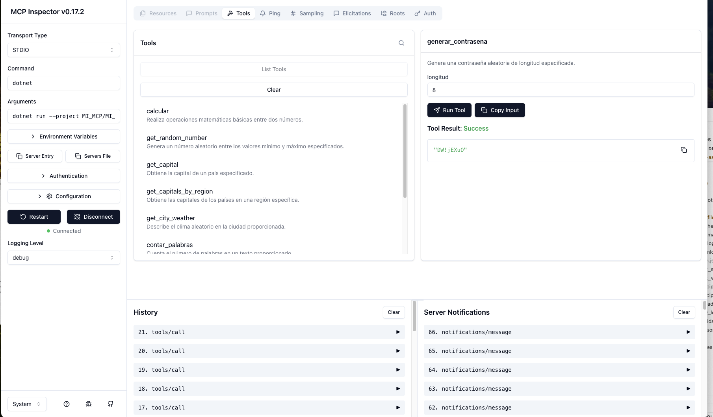
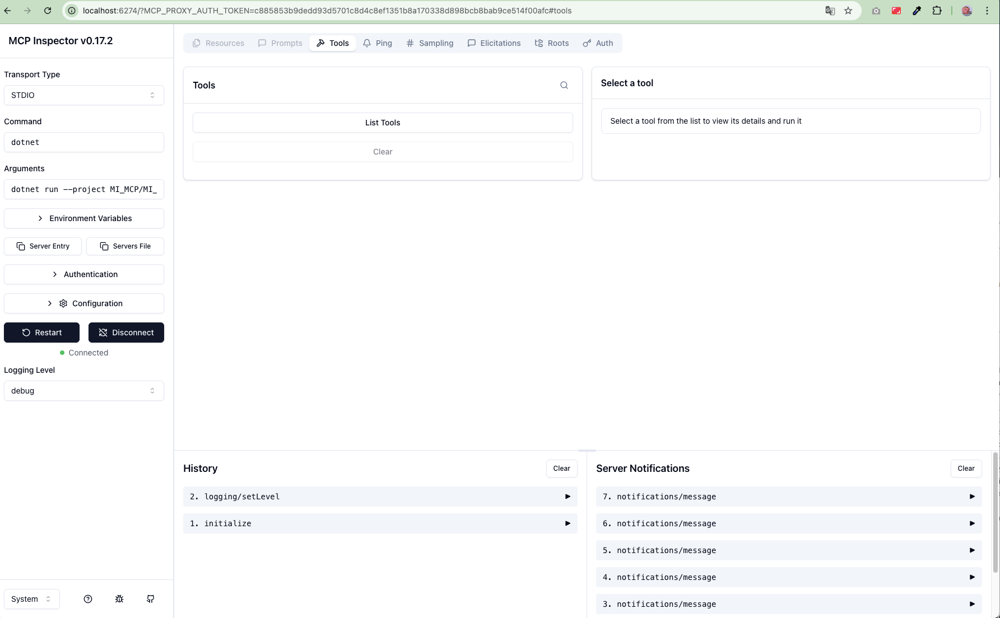

# Servidor MCP




> Nota: las imágenes están en la carpeta `img/` como `img1.png` y `list.png`. Si prefieres moverlas a `docs/images/`, actualiza las rutas aquí o avisame y las muevo.

https://learn.microsoft.com/es-es/dotnet/ai/quickstarts/build-mcp-server

Este README fue creado utilizando la plantilla de proyecto de servidor MCP en C#.
Demuestra cómo puedes crear fácilmente un servidor MCP utilizando C# y publicarlo como un paquete NuGet.

El servidor MCP se construye como una aplicación autocontenida y no requiere que el runtime de .NET esté instalado en la máquina de destino.
Sin embargo, dado que es autocontenido, debe compilarse para cada plataforma de destino por separado.
Por defecto, la plantilla está configurada para compilar para:
* `win-x64`
* `win-arm64`
* `osx-arm64`
* `linux-x64`
* `linux-arm64`
* `linux-musl-x64`

Si tus usuarios requieren soporte para más plataformas, actualiza la lista de identificadores de runtime en el elemento `<RuntimeIdentifiers />` del proyecto.

Consulta [aka.ms/nuget/mcp/guide](https://aka.ms/nuget/mcp/guide) para la guía completa.

Ten en cuenta que esta plantilla se encuentra actualmente en una etapa de vista previa temprana. Si tienes comentarios, por favor completa una [breve encuesta](http://aka.ms/dotnet-mcp-template-survey).

## Lista de verificación antes de publicar en NuGet.org

- Prueba el servidor MCP localmente utilizando los pasos a continuación.
- Actualiza los metadatos del paquete en el archivo .csproj, en particular el `<PackageId>`.
- Actualiza `.mcp/server.json` para declarar las entradas de tu servidor MCP.
  - Consulta [configurando entradas](https://aka.ms/nuget/mcp/guide/configuring-inputs) para más detalles.
- Empaqueta el proyecto utilizando `dotnet pack`.

El directorio `bin/Release` contendrá el archivo de paquete (.nupkg), que puede ser [publicado en NuGet.org](https://learn.microsoft.com/nuget/nuget-org/publish-a-package).

## Desarrollo local

Para probar este servidor MCP desde el código fuente (localmente) sin utilizar un paquete de servidor MCP compilado, puedes configurar tu IDE para ejecutar el proyecto directamente utilizando `dotnet run`.

```json
{
  "servers": {
    "MI_MCP": {
      "type": "stdio",
      "command": "dotnet",
      "args": [
        "run",
        "--project",
        "<RUTA AL DIRECTORIO DEL PROYECTO>"
      ]
    }
  }
}
```

## Probando el servidor MCP

### Usando el Inspector MCP


Para probar el servidor MCP de forma interactiva, puedes usar el inspector oficial de MCP. Esta herramienta te permite ejecutar y probar las herramientas del servidor en una interfaz gráfica en el navegador.

1. Asegúrate de tener Node.js instalado (versión 16 o superior).
2. Ejecuta el siguiente comando desde la raíz del proyecto (`/Users/elbrinner/Documents/Develop/MCP_SIMPLES`):

   ```bash
   npx @modelcontextprotocol/inspector --command "dotnet run --project MI_MCP/MI_MCP.csproj"
   ```

3. El inspector se abrirá automáticamente en tu navegador (por defecto en `http://localhost:5173`).
4. En la interfaz, podrás:
   - Ver todas las herramientas disponibles.
   - Ejecutar herramientas manualmente con parámetros.
   - Ver las respuestas en tiempo real.
   - Depurar errores si ocurren.

Esto es útil para desarrollo y pruebas rápidas sin necesidad de integrar con un cliente MCP completo.

### Herramientas disponibles

#### 1. Números aleatorios (RandomNumberTools)
- **GetRandomNumber**: Genera un número aleatorio entre un mínimo (inclusivo) y máximo (exclusivo).
  - Ejemplo: "Dame un número aleatorio entre 1 y 100" o "Genera 5 números aleatorios entre 10 y 50".

#### 2. Clima (WeatherTools)
- **GetCityWeather**: Describe el clima aleatorio en una ciudad proporcionada. Puedes personalizar las opciones de clima configurando la variable de entorno `WEATHER_CHOICES` (por defecto: templado,lluvioso,tormentoso).
  - Ejemplo: "Dime el clima en Madrid" o "Describe el clima en Nueva York".

#### 3. Matemáticas (MathTools)
- **Calcular**: Realiza operaciones matemáticas básicas (suma, resta, multiplicación, división) entre dos números.
  - Ejemplo: "Suma 15 y 27", "Resta 100 menos 25", "Multiplica 6 por 8", "Divide 144 entre 12".

#### 4. Conversiones (ConversionTools)
- **ConvertirTemperatura**: Convierte una temperatura de grados Celsius a Fahrenheit.
  - Ejemplo: "Convierte 25 grados Celsius a Fahrenheit" o "Cuántos grados Fahrenheit son 0 grados Celsius".

#### 5. Seguridad (SecurityTools)
- **GenerarContrasena**: Genera una contraseña aleatoria de longitud especificada (por defecto 8 caracteres).
  - Ejemplo: "Genera una contraseña de 12 caracteres" o "Crea una contraseña segura".

#### 6. Texto (TextTools)
- **ContarPalabras**: Cuenta el número de palabras en un texto proporcionado.
  - Ejemplo: "Cuenta las palabras en 'Este es un ejemplo de texto para contar'" o "Cuántas palabras tiene esta oración".

#### 7. Países (CountryTools)
- **GetCapital**: Obtiene la capital de un país especificado.
  - Ejemplo: "Cuál es la capital de Brasil" o "Dime la capital de Francia".
- **GetCountriesByRegion**: Lista los países de una región específica.
  - Ejemplo: "Lista los países de Europa" o "Qué países hay en Asia".
- **GetCountryInfo**: Obtiene información básica de un país (población, área, moneda, idiomas).
  - Ejemplo: "Dame información de Alemania" o "Cuéntame sobre Japón".
- **GetCapitalsByRegion**: Lista las capitales de los países de una región específica.
  - Ejemplo: "Lista las capitales de Europa" o "Qué capitales hay en América del Sur".

Para usar cualquier herramienta, simplemente describe lo que quieres hacer en lenguaje natural en Copilot Chat, y el sistema seleccionará automáticamente la herramienta apropiada del servidor MCP `MI_MCP`.

## Publicando en NuGet.org

1. Ejecuta `dotnet pack -c Release` para crear el paquete NuGet
2. Publica en NuGet.org con `dotnet nuget push bin/Release/*.nupkg --api-key <tu-clave-api> --source https://api.nuget.org/v3/index.json`

## Usando el servidor MCP desde NuGet.org

Una vez que el paquete del servidor MCP esté publicado en NuGet.org, puedes configurarlo en tu IDE preferido. Tanto VS Code como Visual Studio utilizan el comando `dnx` para descargar e instalar el paquete del servidor MCP desde NuGet.org.

- **VS Code**: Crea un archivo `<DIRECTORIO DEL ESPACIO DE TRABAJO>/.vscode/mcp.json`
- **Visual Studio**: Crea un archivo `<DIRECTORIO DE LA SOLUCIÓN>\.mcp.json`

Para ambos, VS Code y Visual Studio, el archivo de configuración utiliza la siguiente definición de servidor:

```json
{
  "servers": {
    "MI_MCP": {
      "type": "stdio",
      "command": "dnx",
      "args": [
        "<tu ID de paquete aquí>",
        "--version",
        "<tu versión de paquete aquí>",
        "--yes"
      ]
    }
  }
}
```

## Más información

Los servidores MCP de .NET utilizan el SDK de C# [ModelContextProtocol](https://www.nuget.org/packages/ModelContextProtocol). Para más información sobre MCP:

- [Documentación oficial](https://modelcontextprotocol.io/)
- [Especificación del protocolo](https://spec.modelcontextprotocol.io/)
- [Organización en GitHub](https://github.com/modelcontextprotocol)

Consulta la documentación de VS Code o Visual Studio para más información sobre configurar y usar servidores MCP:

- [Usar servidores MCP en VS Code (Vista previa)](https://code.visualstudio.com/docs/copilot/chat/mcp-servers)
- [Usar servidores MCP en Visual Studio (Vista previa)](https://learn.microsoft.com/visualstudio/ide/mcp-servers)

## Explicación paso a paso para generar nuestro primer MCP

Basado en la guía oficial de Microsoft: [https://learn.microsoft.com/es-es/dotnet/ai/quickstarts/build-mcp-server](https://learn.microsoft.com/es-es/dotnet/ai/quickstarts/build-mcp-server), aquí te explicamos paso a paso cómo crear tu primer servidor MCP en C#.

### Paso 1: Instalar los prerrequisitos
- Asegúrate de tener instalado el SDK de .NET 8 o superior. Puedes descargarlo desde [dotnet.microsoft.com](https://dotnet.microsoft.com/download).
- Instala la plantilla de proyecto MCP ejecutando: `dotnet new install Microsoft.TemplateEngine.Authoring.Templates::8.0.100 --nuget-source https://api.nuget.org/v3/index.json`

### Paso 2: Crear un nuevo proyecto MCP
- Abre una terminal y navega al directorio donde quieres crear el proyecto.
- Ejecuta el comando: `dotnet new mcp-server -n MiPrimerMCP`
- Esto creará una estructura de proyecto básica con archivos como `Program.cs`, un archivo .csproj y un README.

### Paso 3: Agregar herramientas MCP
- En el archivo `Program.cs`, importa los espacios de nombres necesarios: `using ModelContextProtocol.Server;` y `using System.ComponentModel;`.
- Crea una clase para tus herramientas, por ejemplo:
  ```csharp
  internal class MisHerramientas
  {
      [McpServerTool]
      [Description("Una herramienta de ejemplo que saluda.")]
      public string Saludar([Description("El nombre de la persona")] string nombre)
      {
          return $"¡Hola, {nombre}!";
      }
  }
  ```
- Registra la clase en el método `Main` usando `app.MapTools(new MisHerramientas());`.

### Paso 4: Configurar el servidor
- Actualiza el archivo .csproj para incluir las plataformas de destino en `<RuntimeIdentifiers>`.
- Asegúrate de que el proyecto esté configurado como autocontenido.

### Paso 5: Probar localmente
- Ejecuta `dotnet run` para iniciar el servidor.
- Configura tu IDE (VS Code o Visual Studio) con un archivo `mcp.json` apuntando al proyecto, como se muestra en la sección "Desarrollo local" arriba.
- Prueba las herramientas desde Copilot Chat.

### Paso 6: Empaquetar y publicar (opcional)
- Ejecuta `dotnet pack -c Release` para crear el paquete NuGet.
- Publica en NuGet.org usando `dotnet nuget push`.

Sigue la guía completa en el enlace proporcionado para detalles adicionales y mejores prácticas.
